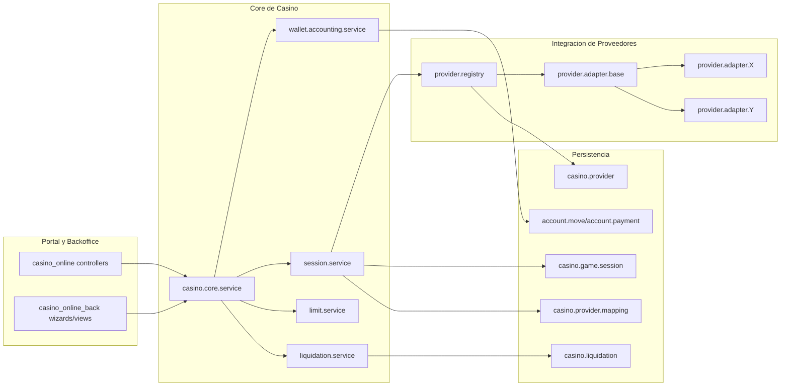

# Arquitectura objetivo multi-proveedor (casino)

## 1) Objetivo

Permitir integrar multiples proveedores de juego sin duplicar logica de negocio,
manteniendo una sola fuente de verdad para:

- Wallet y movimientos contables
- Sesiones y eventos de juego
- Reglas de limites
- Liquidacion por proveedor/categoria

La meta es desacoplar "integracion de proveedor" de "core de negocio".

## 2) Estado base observado

- Cadena actual: casino_online -> casino_online_back -> casino_liquidation
- provider_id ya existe a nivel de juego (product.template)
- La liquidacion ya filtra por proveedor/categoria
- No hay una capa formal de adaptadores por proveedor
- Hay deuda tecnica en casino.game.session (bloques duplicados)

## 3) Principios de arquitectura

- Provider-agnostic core: el core no conoce APIs concretas
- Adapter per provider: cada proveedor implementa el mismo contrato
- Idempotencia fuerte: toda operacion externa con claves de idempotencia
- Event-driven interno: eventos de dominio para desacoplar procesos
- Fallo controlado: retries, dead-letter y reconciliacion
- Trazabilidad total: transaction_id externo + internal_transaction_id interno

## 4) Mapa objetivo (capas)

## 5) Responsabilidades por modulo

### 5.1 casino_online (presentacion/portal)

- Formularios y endpoints web
- No contiene logica de integracion de proveedor
- Llama a servicios de dominio (casino.core.service)

### 5.2 casino_online_back (core de negocio)

- Servicios de wallet, sesiones, limites, conciliacion
- Orquesta la llamada a adaptadores via provider.registry
- Estandariza estados de sesion y errores

### 5.3 casino_liquidation (post-proceso)

- Consume sesiones normalizadas
- Configura comision por proveedor/categoria
- No consulta APIs externas de proveedor

## 6) Modelo de datos objetivo

### 6.1 Nuevos modelos

- casino.provider
  - code (unico): internal slug (ej: prov_a)
  - name
  - state: draft/active/inactive
  - adapter_key: clase/registro de adaptador
  - api_base_url
  - auth_type (token, basic, oauth2, signature)
  - timeout_ms, retry_policy_json

- casino.provider.credential (acceso restringido)
  - provider_id
  - company_id
  - secret_ref (almacen seguro)
  - key_id / api_key_masked

- casino.provider.game.map
  - provider_id
  - product_tmpl_id
  - external_game_id
  - external_lobby_id
  - active

- casino.provider.event.log
  - provider_id
  - direction (inbound/outbound)
  - request_id / correlation_id
  - payload_hash
  - status
  - error_code/error_message

### 6.2 Ajustes en modelos actuales

- casino.game.session
  - provider_id: mantener (source of truth para liquidacion)
  - external_session_id
  - external_round_id
  - idempotency_key
  - provider_status_raw
  - reconciliation_state

- product.template
  - mantener provider_id por compatibilidad
  - migrar gradualmente a casino.provider.game.map

## 7) Contrato de adaptador (interfaz unica)

Todos los adaptadores implementan:

- login_player(payload) -> ProviderResponse
- debit(payload) -> ProviderResponse
- credit(payload) -> ProviderResponse
- get_balance(payload) -> ProviderResponse
- cancel_or_rollback(payload) -> ProviderResponse
- healthcheck() -> ProviderHealth
- normalize_event(raw_payload) -> NormalizedSessionEvent

### 7.1 DTO normalizado

NormalizedSessionEvent:

- provider_code
- event_type (login, debit, credit, settle, cancel)
- external_tx_id
- external_round_id
- player_ref
- game_ref
- amount
- currency
- occurred_at
- raw_payload

## 8) Flujo transaccional objetivo

1. Portal/backoffice solicita operacion al core
2. Core resuelve proveedor via provider.registry
3. Core genera idempotency_key y registro pending
4. Adaptador ejecuta llamada externa
5. Core normaliza respuesta y aplica reglas de negocio
6. Wallet/accounting registra movimiento contable
7. Sesion queda en estado consistente (finished/error/recon_pending)
8. Se emite evento interno para reportes y liquidacion

## 9) Estados y errores

### 9.1 Estados de sesion recomendados

- pending
- in_progress
- settled
- cancelled
- failed
- recon_pending
- reconciled

### 9.2 Politica de errores

- Error funcional proveedor: no retry automatico, respuesta controlada
- Error tecnico/transitorio: retry con backoff exponencial
- Timeout: marcar recon_pending y encolar reconciliacion

## 10) Observabilidad y auditoria

- Correlation-ID por operacion extremo a extremo
- Log estructurado (json) por adapter/core/accounting
- Metricas minimas:
  - latencia por proveedor/operacion
  - tasa de error por proveedor/operacion
  - retries y reconciliaciones pendientes
- Auditoria de payloads (hash + metadata), evitando datos sensibles en claro

## 11) Seguridad

- Secretos fuera de codigo
- Rotacion de credenciales por proveedor
- Firmado/verificacion de callbacks si aplica
- Permisos por rol para operar adaptadores y ver errores tecnicos

## 12) Plan de migracion incremental

### Fase 1: Estabilizacion

- Extraer servicios de dominio (casino.core.service)
- Eliminar duplicacion en casino.game.session
- Corregir inconsistencias de modelos referenciados

### Fase 2: Capa de adaptadores

- Crear provider.adapter.base y provider.registry
- Implementar adaptador del proveedor actual como AdapterV1
- Mantener compatibilidad funcional 1:1

### Fase 3: Datos y mapeos

- Introducir casino.provider y casino.provider.game.map
- Migrar configuracion URL/credenciales desde product.template

### Fase 4: Segundo proveedor

- Implementar AdapterV2
- Pruebas E2E de coexistencia entre proveedores
- Activacion por feature flag por compania/proveedor

### Fase 5: Operacion y hardening

- Reconciliacion automatica
- Dashboards operativos
- SLOs de latencia/error por proveedor

## 13) Riesgos actuales que bloquean escalado

- Duplicacion de metodos en casino.game.session
- Referencias a modelos no confirmados (portal.retiro, portal.bonus)
- Inconsistencia de nombre de modelo en portal_bet_limits (bet.limits vs casino.game.bet.limits)
- Logica de operacion con condicion fragil en res_company

## 14) Criterios de exito

- Agregar un nuevo proveedor sin tocar la logica core
- Misma semantica de wallet para todos los proveedores
- Trazabilidad completa de cada transaccion
- Liquidacion consistente por proveedor/categoria sin reglas especiales ad-hoc
